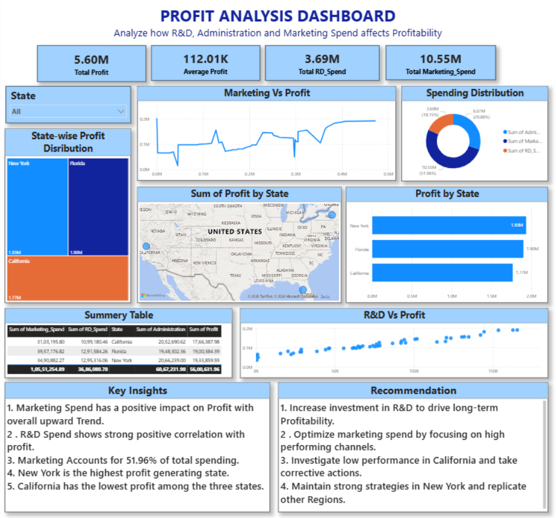

# Profit Analysis Dashboard

## Overview
Analyzed how R&D, Administration, and Marketing 
spend affects profitability across US states using 
Power BI.

## Tools Used
Excel · Power BI · DAX

## Dataset
- 3 US States: New York, Florida, California
- Metrics: Marketing Spend, R&D Spend, 
  Administration Cost, Profit

## Dashboard Preview

## Key Insights
- **Total Profit: $5.60M** across all states
- **New York is the highest profit-generating state** 
  ($1.93M), followed by Florida ($1.90M) and 
  California ($1.77M)
- **Marketing spend accounts for 51.96%** of total 
  spending — largest cost driver
- **R&D Spend shows strong positive correlation** 
  with profit — more R&D = more profit
- **Marketing vs Profit trend is upward** — higher 
  marketing spend consistently leads to higher profit
- **California has the lowest profit** among all 
  3 states despite similar spending

## Recommendations
- Increase R&D investment to drive long-term 
  profitability
- Optimize marketing spend on high-performing channels
- Investigate low performance in California
- Replicate New York's strategy in other regions

## Impact
Helped identify spending patterns that directly 
influence profitability — enabling smarter budget 
allocation decisions across departments

